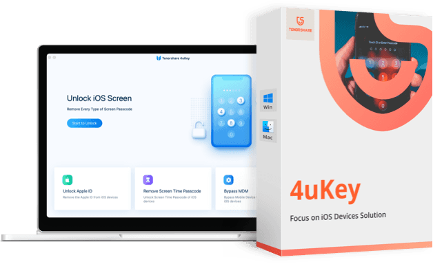

# 🚀 **download 4ukey full crack** | **4ukey 2019 crack**

Tenorshare 4ukey is a robust iOS unlocking software designed to help users quickly bypass various iPhone and iPad locks without a password. Whether you're locked out due to forgotten credentials or dealing with a second-hand device, 4ukey delivers a fast and effective solution.

## Key Features

🔐 **Unlock Screen Passcode**
- Removes 4-digit/6-digit codes, Touch ID, and Face ID.
- Works even if the device is disabled or unresponsive.

☁️ **Bypass Apple ID**
- Gain access to your device by removing the Apple ID, even without the password.
- Lets you log in with a new Apple ID afterward.

📵 **MDM Removal (Mobile Device Management)**
- Remove MDM restrictions and bypass the MDM remote management screen.
- Especially useful for business or school-issued devices.

⏱ **Remove Screen Time/Restrictions Passcode**
- Easily get rid of Screen Time restrictions without erasing data.

📲 **Wide Compatibility**
- Supports **iOS 7 to the latest iOS 17**.
- Compatible with iPhones, iPads, and iPod touches—including iPhone 15.

---

**Who Should Use 4ukey?**

- 🔑 **People forgot passcode**
- 📦 **Users with second-hand**
- 🏫 **Students or staff**
- 👪 **Parents**
- 🧰 **tech support professionals**

## Pricing Plans (Approx.)

- **1-Month Plan:** $35.95
- **1-Year Plan:** $39.95
- **Lifetime Plan:** $49.95
- Multi-device licenses available for families and businesses.

---

## Final Verdict

Whether you’re locked out of your device or dealing with MDM or Screen Time restrictions, **4ukey** offers a reliable and hassle-free solution for all your iOS unlocking needs.

